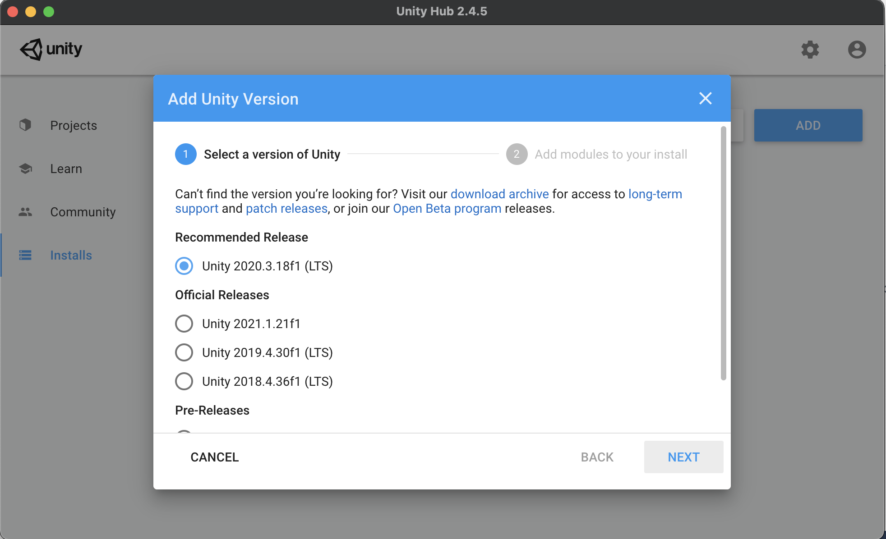
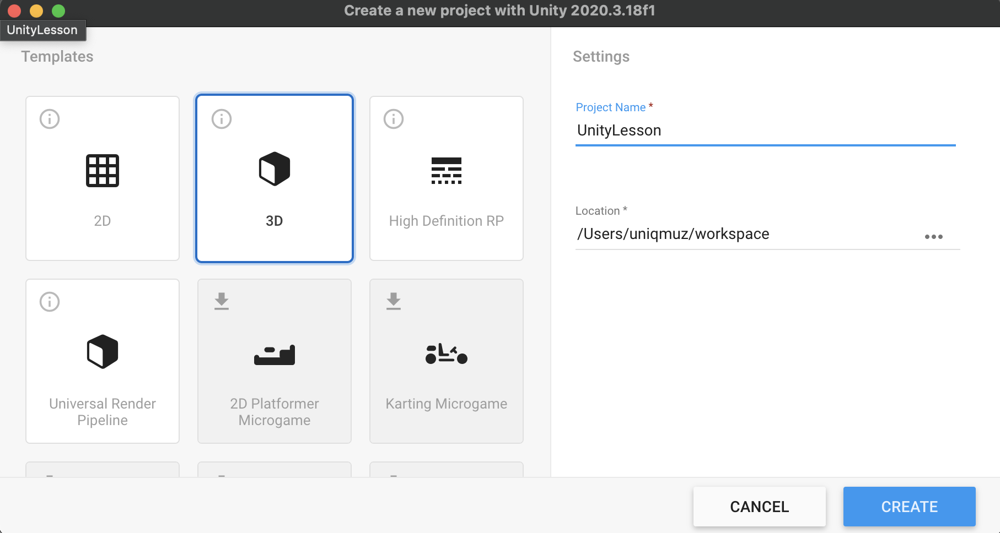

# Environment setup

### 1. Install unity hub

[Click to download](https://public-cdn.cloud.unity3d.com/hub/prod/UnityHubSetup.dmg?_ga=2.259291914.1274685973.1631798132-41021995.1599911013)

#### 1-1. Setup firewall

### 2. Install Unity 2030.3 LTS

### 3. Add modules

#### 3-1. \(Mac\) Select nothing

#### 3-2. \(Windows\) Select 'Visual Studio Community 2019' and 'Universal Windows Platform'

### 4. Make new project

