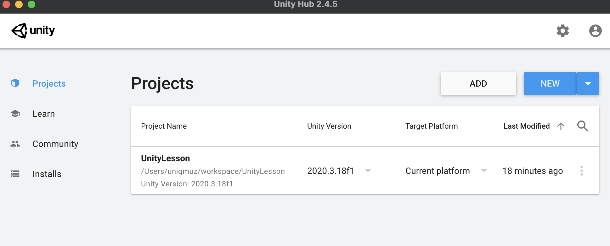
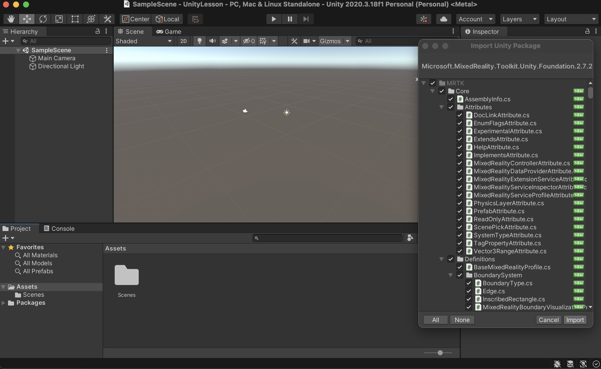
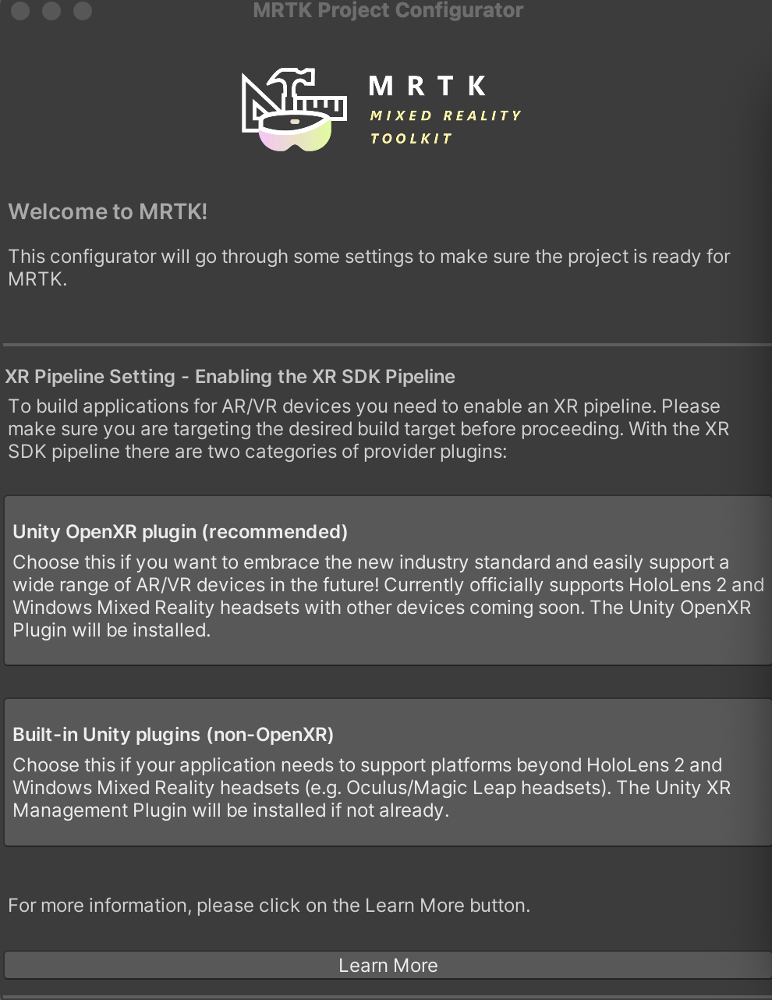
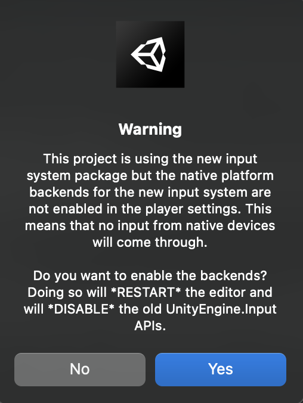
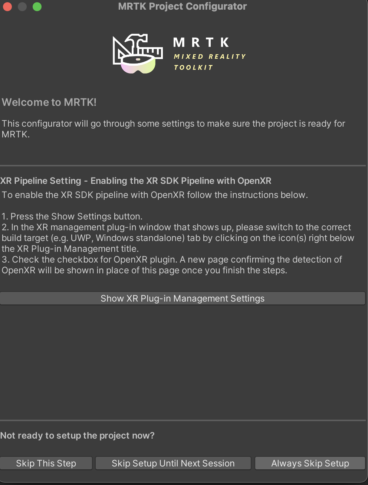
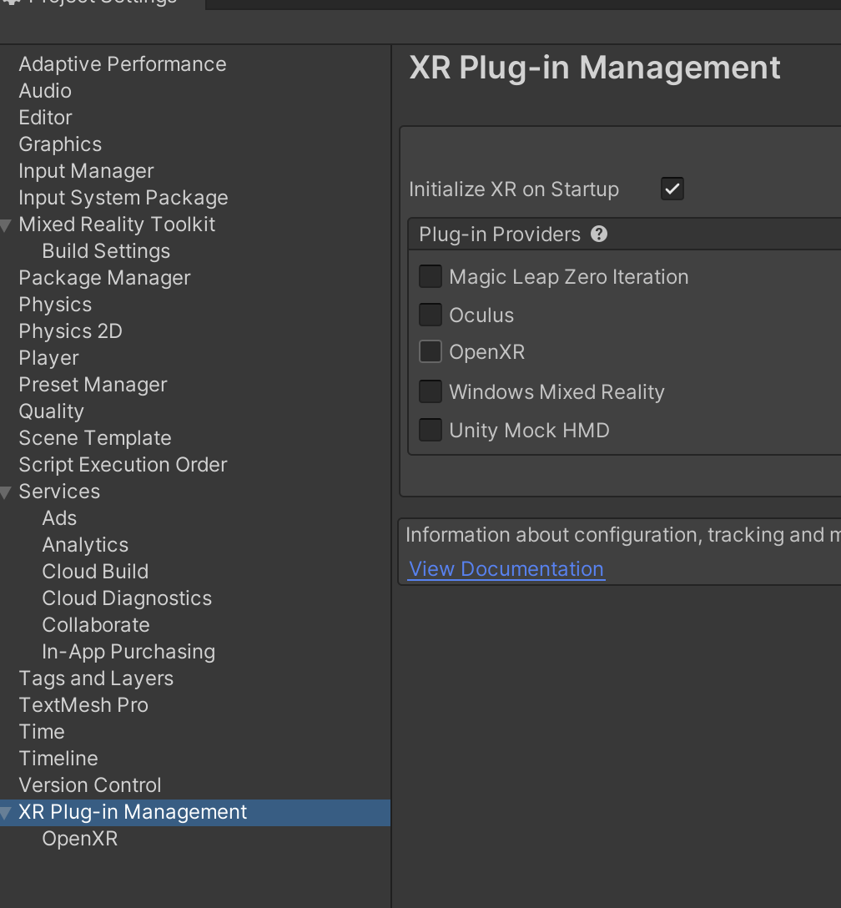
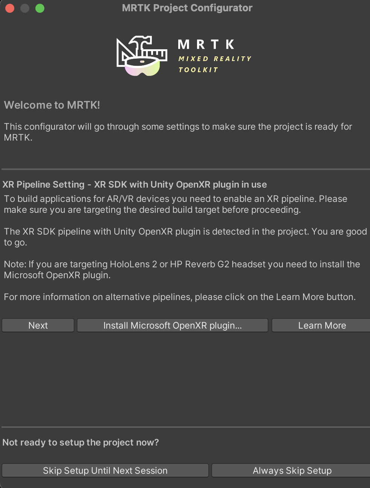
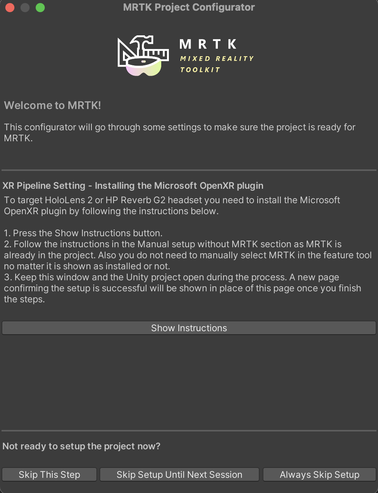

# MacOSX

### 1. Download unity packages

[Download Foundation](https://github.com/microsoft/MixedRealityToolkit-Unity/releases/download/v2.7.2/Microsoft.MixedReality.Toolkit.Unity.Foundation.2.7.2.unitypackage)

[Download Extensions](https://github.com/microsoft/MixedRealityToolkit-Unity/releases/download/v2.7.2/Microsoft.MixedReality.Toolkit.Unity.Extensions.2.7.2.unitypackage)

[Download Examples](https://github.com/microsoft/MixedRealityToolkit-Unity/releases/download/v2.7.2/Microsoft.MixedReality.Toolkit.Unity.Examples.2.7.2.unitypackage)

[Download Tools](https://github.com/microsoft/MixedRealityToolkit-Unity/releases/download/v2.7.2/Microsoft.MixedReality.Toolkit.Unity.Tools.2.7.2.unitypackage)

### 2. Open unity project to import

### 3. Import unity packages \('Open' in finder\)

#### 3-1. 'Import' in Unity

#### 3-2. Keep this window 😎

### 4. Setup MRTK Project Configurator

#### 4-1. Select 'Unity OpenXR plugin \(recommended\)

#### 4-2. 'Yes' \(Restart unity project\)

#### 4-3. Follow instruction 😔

#### 4-4. Install OpenXR Plugin

 

